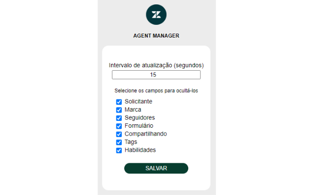
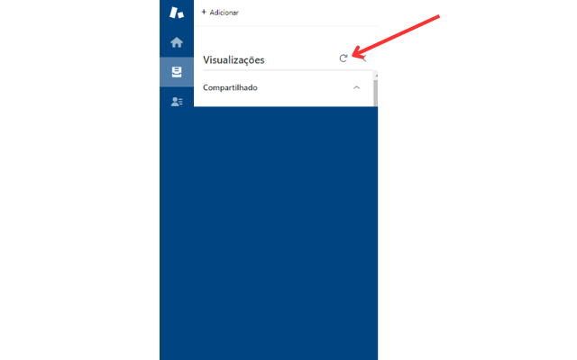

### Zendesk Agent Manager

Projeto criado para ser utilizado como app do Google Chrome  
Tem a função de atualizar a página de visualização no Zendesk de acordo com o tempo programado nas configurações 
Também é possível selecionar as caixas para ocultar alguns campos na visão do agente, a intenção é tornar a visualização 
menos poluída para o agente, visualizando somente os campos necessários ao atendimento 
 

 

Acesso em : https://chromewebstore.google.com/detail/zendesk-agent-manager/eobooklmeelihimnigioognafjhnkpmc
